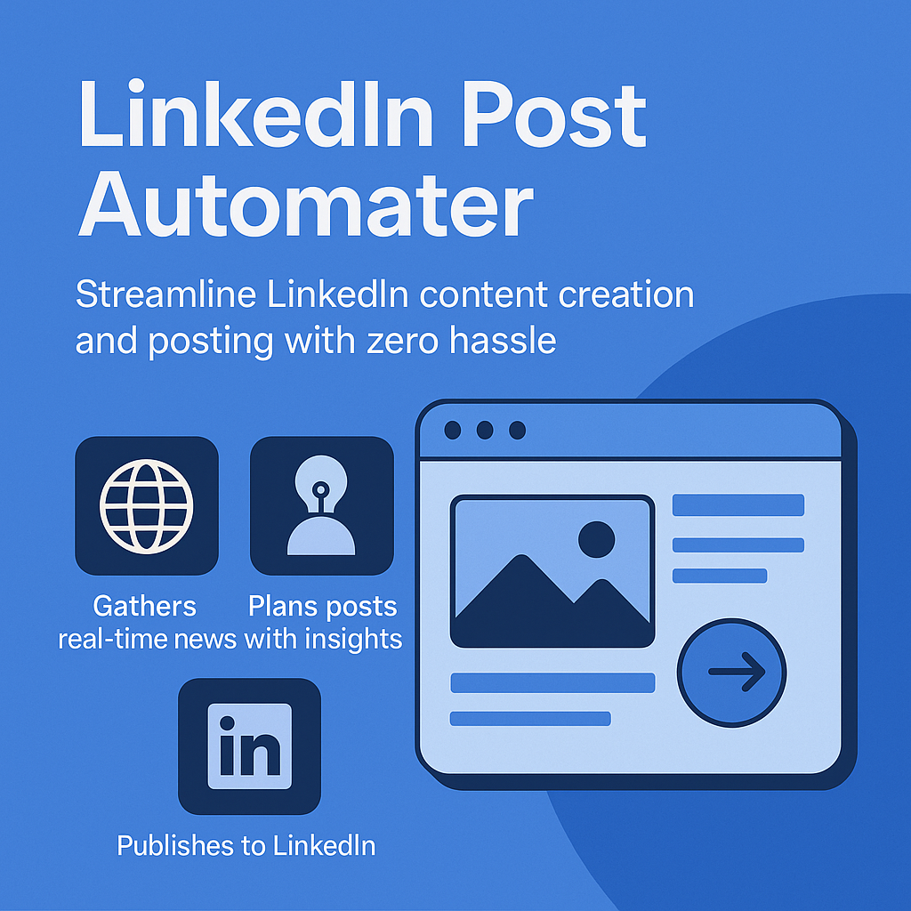
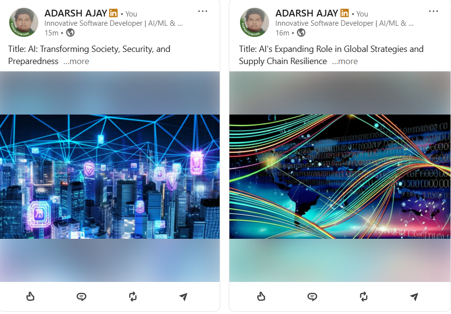

# 💼 LinkedIn Post Automater

**LinkedIn Post Automater** is an AI-powered solution that simplifies the entire process of creating and publishing professional content on LinkedIn.

Whether you're an entrepreneur, thought leader, or marketing professional, this tool empowers you to stay active and relevant with consistent, high-quality posts—without the manual effort.

---

## 🚀 What It Does

🔹 **Finds the latest news**  
🔹 **Builds structured and engaging post content**  
🔹 **Generates eye-catching visuals**  
🔹 **Publishes automatically to LinkedIn**

All in one intelligent, fully automated workflow.

---

## 💡 Why It Matters

Staying active on LinkedIn requires time, strategy, and creativity.  
**LinkedIn Post Automater** handles all three—so you can focus on what really matters: engaging with your network and growing your influence.

---

## 🌟 Key Benefits

- ✨ Thoughtful, AI-written content tailored for LinkedIn  
- 🧠 Real-time relevance through live news research  
- 🖼️ Visual posts designed to stand out in feeds  
- ⏱️ Time-saving automation from start to finish  
- 📈 Consistent, high-quality posting without burnout

---

## 🧩 Ideal For

- Founders & Startup Teams  
- Personal Branding Experts  
- B2B Marketers  
- Content Strategists  
- Anyone growing their voice on LinkedIn

---

## 📌 Outcome

With **LinkedIn Post Automater**, you're not just posting—you’re building a presence.

---

> “Let the AI handle the posts. You focus on the conversations.”  
